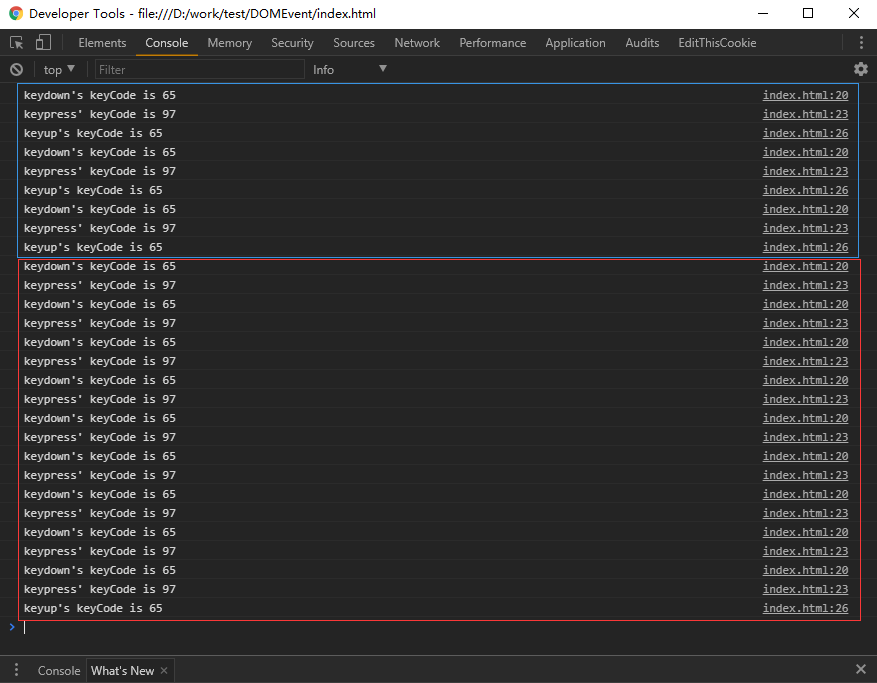
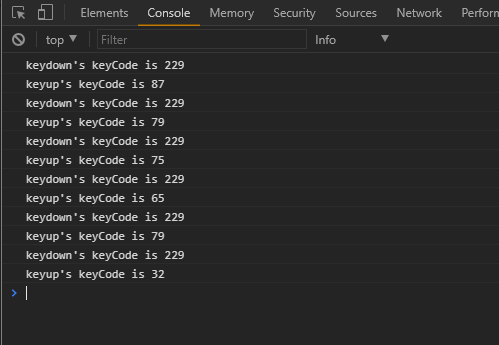
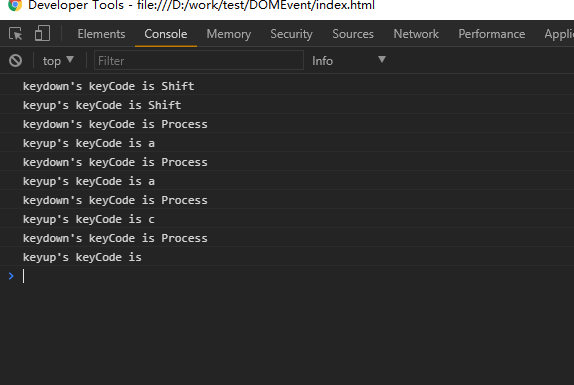

## JavaScript DOM事件的触发顺序

之前在写一个小控件[(实现一个仿百度的下拉菜单的控件)](https://github.com/LucaslEliane/dropdown)的时候遇到了一些问题，其中最核心的问题在于，有些时候键盘、鼠标、DOM事件的触发机制和我们预想中的不太一致，这样就导致了在使用的时候会造成混乱。

有时候需要触发一个事件的时候，其他事件在这个事件之前触发，导致了不能获取当前事件的状态。

下面所有的测试环境均在支持`addEventListener`的浏览器环境下。。。。

### 键盘事件

键盘事件主要有3个，`keydown`，`keypress`和`keyup`，先测试一下这三者的触发顺序。

给一个`input`元素绑定上这三个事件，敲一下键盘：

```javascript
const input = document.querySelector('#input-box');
input.addEventListener('keyup', function(event) {
  console.log(`keyup's keyCode is ${event.keyCode}`);
});
// 另外两个事件的回调基本上类似
```

控制台中的结果是这样的：



其中蓝色框标出的为短按键盘上某个按键弹出的结果，也就是，键盘事件的触发顺序为：

keydown --> keypress --> keyup

而在长按某个按键的时候，其触发顺序和一般的顺序不一致。

keydown --> keypress --> keydown --> keypress ...... --> keyup

*重点在于`keypress`获得的键码和另外两个事件的键码不一致，这是由于只有keypress事件区分大小写，所以他的键码会和其他的键码不一致。*

而且，在使用中文输入法进行输入的时候：



对于`keypress`的键码会捕获不到，而`keydown`的键码被捕获为229键码的占位符，这样对于键盘事件的处理造成很大的问题。

所以，目前在MDN中，`KeyBoardEvent.keyCode`属性已经被标注为deprecated，并且不推荐使用，建议使用`KeyBoardEvent.key`属性来进行替代。

`KeyBoardEvent.key`发送出来的结果是一个字符串类型，直接将键盘事件中获得的字符串获取到，并且对于中文输入法的支持也是不同的。



可以看到，键盘的shift按键会被直接捕获为`Shift`字符串，而在使用中文输入法的时候，按下某个按键，`keydown`事件会捕获到当前正在使用其他输入法，捕获的键码为特殊的`Process`字符串，而在`keyup`事件的时候，捕获正确的按键字符串。并且也没有触发`keypress`事件。

`KeyBoardEvent`在进行输入框内容捕获的时候是必须的，比如在进行注册信息的实时校验，进行用户输入的自动补全这些情况下基本都需要使用到这个事件。

### blur、change和click之间的关系

#### form表单的onchange

很多form表单都需要在用户输入的时候进行判断，有些时候可能会考虑用到`change`事件，但是这里要注意，`change`事件的触发条件可能和想像中是不相同的。

`change`事件需要在当前输入框的焦点被取消掉之后，才会进行触发，所以如果要进行表单的实时验证，可以参考上面的键盘事件，键盘的三个事件都会直接和输入触发挂钩，如果为了兼容中文输入法，那么最好使用`keyup`来捕获键盘事件，这样`KeyBoardEvent.key`属性基本可以捕获到所有的键码。

#### blur和click

有时候对于下拉菜单的设计，需要对于下拉菜单的内容点击进行选择，这里要注意`blur`事件和`click`事件的触发顺序。

或者对于一个表单元素和按钮，我们需要在点击按钮之后，获取表单元素的内容，但是又需要将表单元素的内容清空，这时候如果我们在`blur`事件中将表单元素清空，在`click`事件中获取表单元素的内容，这样就会出现问题：

```HTML
<input type="text" id="input-box" />
<button id="input-button">GET infomation</button>
<script>
  const input = document.querySelector('#input-box');
  const button = document.querySelector('#input-button');
  input.addEventListener('blur', function(event) {
    input.value = "";
    console.log('input blur');
  });
  button.addEventListener('click', function(event) {
    console.log('button click');
    console.log(`input's value is ${input.value}`);
  });
</script>
```

先点击input，输入相关的内容，在点击按钮，这时候，首先会触发`blur`事件，让输入框中的内容被清除，然后触发`click`事件，但是`click`事件触发的时候，已经获取不到输入框元素的内容的。

针对这个内容，可以进一步看一下鼠标事件的处理方式。

### MouseEvent

MouseEvent对象的接口是对于用户的指针相关设备进行的。会触发总共四个事件：`click`，`dblclick`，`mouseup`，`mousedown`。

针对一个`button`按钮添加这四个事件：

* 当单击这个按钮的时候，事件的触发顺序是：mousedown --> mouseup --> click
* 当双击这个按钮的时候，事件的触发顺序是：mousedown --> mouseup --> click --> mousedown --> mouseup --> click --> dblclick

在这里可以看到，鼠标按钮按下和抬起的两个操作的事件都要早于`click`事件，无论单击还是双击。那么和`blur`事件呢？

先点击输入框，让输入框触发焦点，然后点击`button`按钮，这时候输入框会失去焦点，这时候事件的触发顺序是这样的：

mousedown --> blur --> mouseup --> click，可以看到click事件仍然是在blur事件后面触发，由于浏览器对于脚本的执行是单线程的，所以在事件触发的时候，执行每个事件的处理函数也是单线程的。于是`blur`的清理工作会导致`click`无法获取自己需要的内容，但是`mousedown`事件是触发在`blur`事件之前的，所以在遇到这种情况的时候，用`mousedown`事件来代替`click`事件是一个比较好的选择。