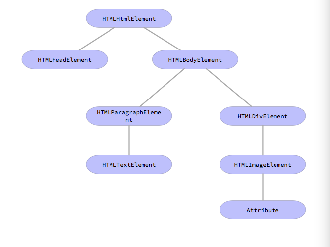

## 浏览器渲染工作原理

### 主流浏览器

目前的主流浏览器有五种：IE、FireFox、Chrome、Safari、Opera。这五种浏览器基于三种主要的浏览器内核，IE的内核*Trident*，Firefox的内核*Gecko*，Safari和Chrome的内核*Webkit*以及Opera的内核*Presto*。

浏览器的主要功能是将用户选择web资源呈现出来，从服务器请求资源，并且进行渲染。

### 渲染

渲染引擎的职责是渲染，在浏览器的窗口中显示请求到的内容。最主要的用途是显示应用了CSS之后的HTML以及图片等。

#### 渲染流程

渲染引擎首先通过网络获取到所请求的文档的内容，然后根据获取到的文件来进行渲染：

解析HTML来构建DOM树—>构建render树—>布局render树—>绘制render树。

渲染引擎首先会*解析HTML*，并且将标签转化为DOM节点。然后解析外部CSS文件以及内联的style，通过这些信息来构建render树。render树是由*含有大小和颜色等属性的矩形组成*，render树构建好之后，会执行*布局过程*。确定render树节点在屏幕上的确切坐标，然后遍历render树，将节点逐个绘制到UI上。

这个过程不是串行的，也就是DOM树解析了一部分之后就开始进行render树的构建和渲染，这样可以尽早将内容呈现到屏幕上。解析完一部分显示一部分。

### 解析与DOM树的构建

DOM树的解析过程其实就是HTML代码的编译过程，将一个HTML文档转换为一个可以表达该文档结构的节点树。

HTML的文法使用DTD格式进行定义的，在HTML5中不需要使用DTD进行解析了。这个解析的结果就是生成一棵DOM树，这个树是由DOM元素以及属性节点组成的。

```html
<html>
  <head>
  </head>
  <body>
    <p>
      A paragraph element
    </p>
    <div>
      
    </div>
  </body>
</html>
```

上面的HTML文档转换为DOM树应该是这样的：



HTML的解析采取有限状态机的方法，逐个进行字符的读取，每读取一个字符，状态机的状态都可能发生改变，根据状态转移来构建DOM树。

初始的状态为`Data state`，直到遇到一个`<`字符，这时候就需要读取一个标签的内容了，状态机的状态变为`Tag name state`，表示下面应该读取标签内容了，直到读取了一个`>`字符，当前的标签读取完成了，状态转移回了`Data state`。

当解析完成之后，会进入DOM树的构建阶段，初始化的时候，DOM树是一个仅包含`Document`根节点的树，逐个将元素附加到这个树上。DOM元素和状态机解析出来的符号是有映射关系的，根据状态机解析的结果，会将DOM元素挂载到树上，并且推入栈，这个栈是用来*确定嵌套的DOM元素的匹配关系的*，这类似于括号匹配问题。

在完成了DOM树的构建过程之后，浏览器会触发一个load事件，也就是常用的`window.onload`监听的事件。

由于web的模式是同步的，所以浏览器解析到一个外部资源，那么就会阻塞文档直到脚本执行完成，或者加载完成，这个过程也是同步的，除非将脚本指定为`defer`，才不阻塞文档解析并且在文档解析结束后执行。HTML5允许标记脚本为异步--`async`，来让脚本的解析使用另外一个线程。

### 构建渲染树

当DOM树完成了构建之后，浏览器会开始构建另外一棵树—渲染树。每一个渲染对象用一个该节点的CSS盒模型对应的矩形区域来表示。包含宽、高、位置之类的信息。

#### 渲染树和DOM树

渲染对象和DOM元素是相对应的，但是这种对应关系不是绝对的。因为有一些不可见的DOM元素是不会插入到渲染树当中的，比如`head`元素或者`display: none`的元素。

并且有些元素不仅仅只有一个可见对象，比如`select`元素，就分为几个区域。

#### 样式计算

创建渲染树需要计算出每个渲染对象的可视属性，可以通过计算每个元素的样式得到。样式通过样式表以及内联样式以及系统默认样式中获取。

由于样式表可能会很大，那么在对每个元素查找其样式的时候，如果不加优化，那么匹配查找的速度会很慢。

样式表匹配的时候已经进行了一定的优化，比如对于样式表的从右到左匹配等，但是在书写样式的时候还是应该尽量精确的样式匹配规则，这样可以很大的提升页面的渲染速度。

渲染引擎会首先添加规则的映射，在进行遍历的时候，将具有某些属性的元素和具有该属性的样式表进行映射，查询的时候首先对映射规则进行处理，如果含有映射关系，则可以直接在映射中获取样式信息。

##### Specifity

CSS中对于样式选择符优先级的指定：

* a：如果声明来自于内联样式，计1，否则为0；
* b：选择器中id属性的数量；
* c：选择器中class属性以及伪类的数量；
* d：选择器中元素名以及伪元素的数量。

比如：

```Css
li.red.level {}
/* a=0 b=0 c=2 d=1 ==> specifity: 0,0,2,1 */
#x34y {}
/* a=0 b=1 c=0 d=0 ==> specifity: 0,1,0,0 */
ul ol+li {}
/* a=0 b=0 c=0 d=3 ==> specifity: 0,0,0,3 */
```

通过这个值来确定样式的级联顺序，从低到高一层一层覆盖添加样式。

### 布局

当渲染对象被创建并且添加到树中的时候，并没有位置和大小，对于这些的计算称为回流。HTML基本采用的是流式布局模型，递归进行布局。

### 绘制

绘制阶段，遍历渲染树并且调用渲染对象的`paint`方法将它们的内容显示在屏幕上。和布局一样，绘制也可以是全局的或者增量的，如果一些渲染只需要修改dirty区域的话，那么会直接对该区域以及其子元素进行重绘。

### conclusion

浏览器从我们输入URL访问开始，会执行下面的操作：

1. 输入网址，访问指定的域名。
2. 查看对应的URL，在本地是否有缓存存在，如果存在，那么检测缓存是否过期，如果未过期，那么直接使用该缓存。
3. 如果缓存过期，通过DNS查找域名对应的IP地址。并向该地址发送一个HTTP请求。
4. 如果服务端返回一个重定向请求，那么就向该IP发送一个HTTP请求。
5. 服务端返回一个HTML页面，浏览器对HTML进行解析，在解析的过程中如果遇到了需要向服务端请求的资源，那么会向服务器发送HTTP请求，在这个过程中也会构建DOM树。
6. 构建DOM树的同时，会根据样式表以及各种静态资源构建渲染树。
7. 根据渲染树对页面进行布局以及绘制。然后将绘制的结果显示在浏览器窗口中。

在进行渲染的过程中，可能发生回流（reflow）以及重绘（repaint），导致回流的原因可能是因为：页面初始化、操作DOM、元素的大小发生了变化等。回流会导致浏览器对某些元素进行重新布局和渲染，而重绘仅仅是对于一些颜色或者是字体等变化，不需要重新渲染，所以速度较快。

#### 对于CSS

通过渲染流程中的render树构建可以看出，CSS的匹配规则是从右到左的，所以

* 比较精确的CSS样式可以更快的进行匹配，
* 而后代选择器，id，class等选择器的精确度更高，更容易快速匹配到对应的样式。
* 并且嵌套过深的CSS样式很难进行匹配，需要多层匹配，
* 最右侧的样式如果精确度较高可以更好的进行快速匹配，
* 通配符会严重影响效率，所以尽量少的使用。

#### 回流及重绘

元素大小的变化、元素布局的变化，DOM元素的添加和删除，元素的位置变化，页面初始化等工作都会导致回流，而颜色改变，字体变化等不会影响页面布局情况的改变只会导致重绘，回流必然会引起重绘，所以尽量将回流的次数控制在最小：

* 使用下层元素的class来修改样式：从下层开始的回流会产生对页面布局的最小影响，回流会一层一层向上冒泡，直到有一个元素的布局没有发生变化为止，这样会在影响元素最少的情况下完成回流，并且通过class修改的单元素节点样式的改变只会引起一次回流，如果一次修改了多级元素，那么每一级元素都会引起一次回流。
* 动画效果应用到`absolute`和`fixed`元素上，这些元素的位置会脱离文档流，不影响其他元素的布局，只会导致重绘，而不会导致一个完整的回流。
* 牺牲动画的平滑程度换取速度，当每次1px的移动元素，如果移动的不是绝对定位的元素，那么就会导致一次回流，如果换成一次3px的移动速度，那么回流次数将会减少为原来的1/3。
* 避免使用`table`：`table`布局中，后面进入的元素可能会导致前面元素的回流。比如最后一列的内容过长，那么前面每一行的最后一列的宽度都要修改。一些小的变化都会导致表格中其他节点回流。