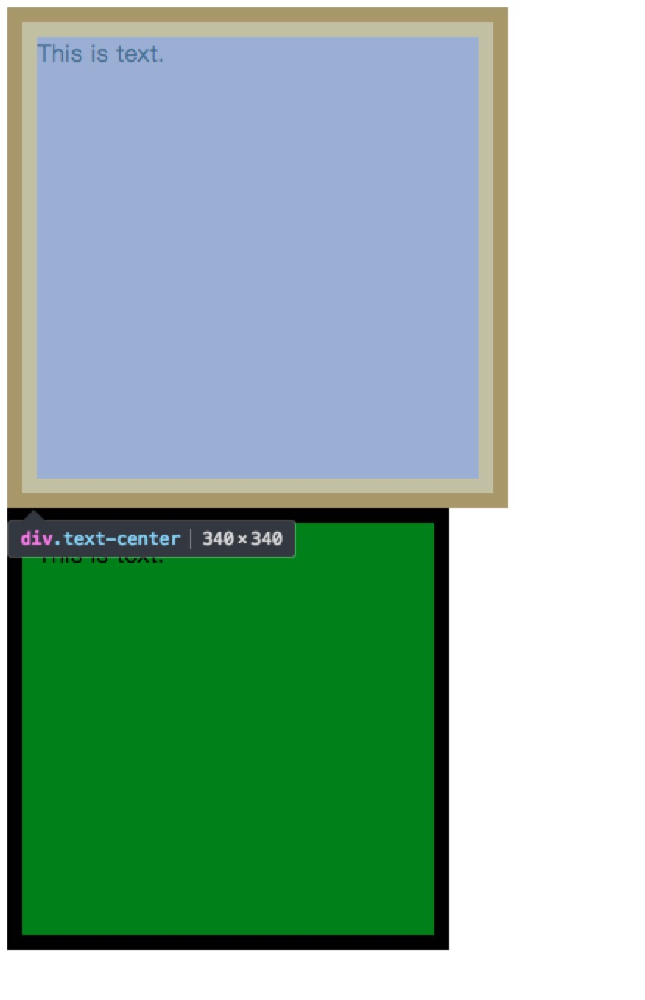
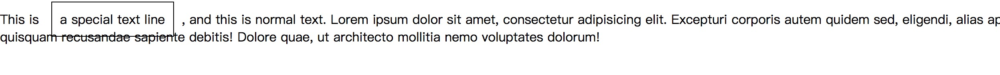

## 盒模型、BFC和IFC

### 盒模型(box model)

在web页面的早期，由于IE和其他浏览器的实现不一致，导致了很多CSS和JavaScript的相关不兼容问题，其中box model就是其中的一个。

如果不指定`<!DOCTYPE>`的话，也就是不指定浏览器对于页面的渲染模式的话，低版本的IE对于页面的渲染采用其本身的box model，也就是border-box。

对于所有的现代浏览器以及指定了渲染模式的低版本IE，默认情况下的渲染方式都是采用content-box来进行的。这两个box model的区别主要在于如何计算整个元素的大小的。

如果不设置padding和border的情况下，这两个box model的渲染方式是一致的。如果对于这两个属性进行了设置的话：

```css
#box1, #box2 {
  height: 200px;
  width: 200px;
  padding: 10px;
  border: 10px solid black;
}
#box1 {
  box-sizing: content-box;
}
#box2 {
  box-sizing: border-box;
}
```



可以看到设置为content-box的元素要明显大于设置为border-box的元素，并且大出的大小刚好等于`2 * padding + 2 * border`。这样就表示了content-box设置的宽度和高度是不包含border和padding的，仅仅是元素内部的content的宽高。而border-box顾名思义是包含这两个内容的。

也就是说，`width of border-box element = border-left + padding-left + content-width + padding-right + border-right`。

当然所有的现代浏览器在默认情况下都使用的是w3c标准的content-box。但是如果需要切换box-model的渲染方式的话，也可以手动切换到border-box。

border-box在布局的时候使用起来是很方便的，因为在我们的正常想法中，一个元素的宽和高本身就应该是所有可见区域的大小，而不是仅仅是content部分的大小。

比如我们在进行一个两列布局的时候，其中有个的宽度为30%，而另外一个元素的宽度为70%，并且设置两个块级元素的浮动，这样刚好就是整个父元素的宽度了，但是如果对这两个元素设置一下padding或者border，那么这两个元素就会发生换行，因为实际上的宽度并不是我们想象的那样，37分，而是double padding加上double border，这样第一个元素的宽度就超过了30%，而剩下的区域不够容纳第二个元素，所以被挤到了下一行。

由于margin元素是不可见的，对于可视区域来说，border-box这样的模型更加符合我们对于宽和高的认知，并且可以在很多布局情况下使用。

### BFC

BFC和下面要说的IFC都是浏览器在进行页面渲染时候的规则，BFC是一种渲染区块，这个区块需要一定的条件来触发，一旦触发BFC之后，其内部和本身的渲染都是根据特定的规则进行的。

> Boxes in the normal flow belong to a formatting context, which my be block or inline, but not both simultaneously. Block-level boxes participate in a block formatting context. inline-level boxes participate in an inline formatting context.

块级元素会参与块级上下文，而行内元素会参与行内上下文。块级元素也就是`display`属性为block,list-item,table的元素。如果一个块级元素内部含有一个块级元素，那么就会强制里面的所有元素都成为块级元素，采用块级上下文进行渲染。

如果一个行内元素包含一个在正常文档流中的块级元素，那么行内元素的box将被破坏，这个行内box将会被切成两个部分，并且在两者中间插入一个匿名的块级元素。来保证渲染的正常。

如果满足下面的条件之一，都会生成一个新的块级上下文：

* 浮动元素
* 绝对定位元素：absolute、fixed
* 不是块级盒的块级容器，也就是元素的display不为block，比如inline-blocks、table-cells、table-captions、flex、inline-flex等。
* overflow不为visible的元素

这四种元素会创建一个新的渲染上下文。也就是BFC。

而对于一个BFC来说，其具有一些特殊的渲染规则：

* 其内部的盒子从上至下垂直的一个一个放置，两个盒子之间的距离由margin属性决定，*相邻的块级盒子的margin将会重叠，也就是两者取大的那个*。
* 在块级上下文中，每个盒子的左边界和父元素的左边界相接。除非这个盒子创建了一个新的块级上下文。

剩下的几个布局规范并没有在w3c的文档中看到，但是确实是有用的：

* BFC区域不会和float box重叠。(这个似乎有一些问题，可以自己去试一下，如果某个元素通过absolute生成一个BFC的话，那么仍然会重叠，这和float以及absolute脱离文档流的方式有关系，float在脱离了文档流之后仍然会占据相应的空间，而absolute则直接会完全脱离文档流，所以absolute会覆盖掉float的元素)。
* 计算BFC高度的时候，其内部的float元素也会参与计算。（这个方法正好可以用来清除浮动，因为浮动会导致其不能够撑开父元素的高度）。

### IFC

和BFC相对的，就是IFC，行内格式化上下文。

在IFC中，盒子是按照水平方向进行排列的，水平方向的margin、border和padding都是有效的，但是在垂直方向上，这三个值虽然有效，但是不会对布局产生任何影响，也就是IFC中的元素的上下margin、border和padding都不会改变当前布局的情况。比如：

```HTML
<p>This is <span style="padding: 10px; margin: 10px; border: 1px solid black;">a special text line</span>, and this is normal text. Lorem ipsum dolor sit amet, consectetur adipisicing elit. Excepturi corporis autem quidem sed, eligendi, alias aperiam voluptates officia, quisquam recusandae sapiente debitis! Dolore quae, ut architecto mollitia nemo voluptates dolorum!
</p>
```

上面这段代码中的`span`被设置了内外边距和边框，这些内容其实是可以看到的，但是并不会影响布局，下一行的本文仍然会踩在边框上面。但是左右，也就是水平方向上的内外边距和边框会占据空间，影响布局。



如果需要让垂直方向的上的距离被让开，那么需要设置行高来区分。

对于IFC来说，如果需要设置垂直的对齐方式，那么需要使用`vertical-align`属性来进行修改。

IFC的宽度取决于包含块，而高度取决于行高的计算结果。

IFC的高度总是高于包含其内的所有盒子的高度。

如果IFC内部的盒子超出了包含块的宽度，那么这个IFC将会被折行，折行之后，每一行都会作为一个新的line-box。

这里说到了`vertical-align`属性，这个属性主要是对inline和inline-block元素进行垂直对齐方式设置的。其对齐方式是基于父元素的高度来确定的。如果设置的行高高于内容的高度，那么也就是依照行高来确定的，如果内容高度高于父元素的行高，那么则是按照当前显示的高度来确定的。

w3c标准中给了一个关于IFC的例子：

```html
<p>Several <em>emphasized words</em> appear <strong>in this</strong> sentence, dear.</p>
```

`p`元素生成了一个块级盒子，然后其内部含有五个行内盒子，其中两个是具名的，剩下被切分出来的三个是匿名的。这个段落被格式化的时候，如果`p`的宽度足够宽，那么所有的内容将会被放在一行内显示，从左到右挨个排列，但是如果`p`的宽度不够，那么这些元素将会被折行。

整个p元素的高度取决于内部的五个行内盒子的最大高度，如果发生了折行，那么每一行的高度就是其内部的最大高度，然后这些最大高度的和就是整个IFC的高度。

