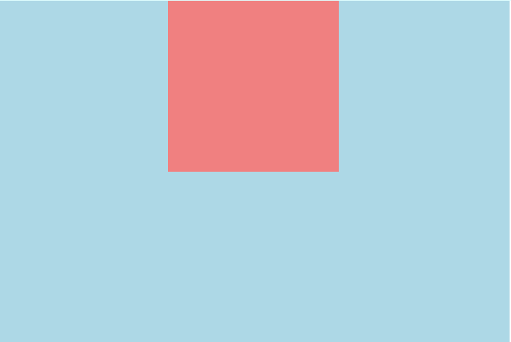
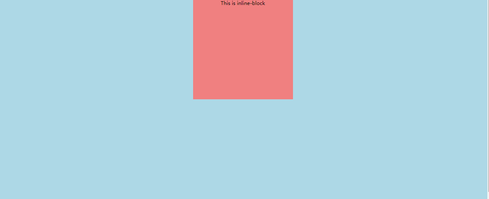
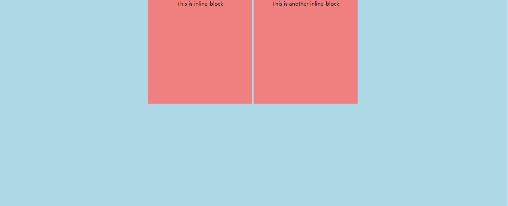
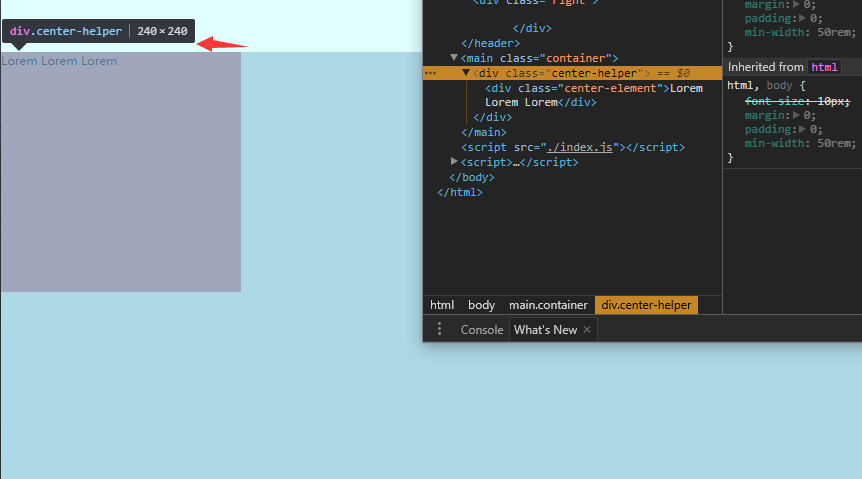
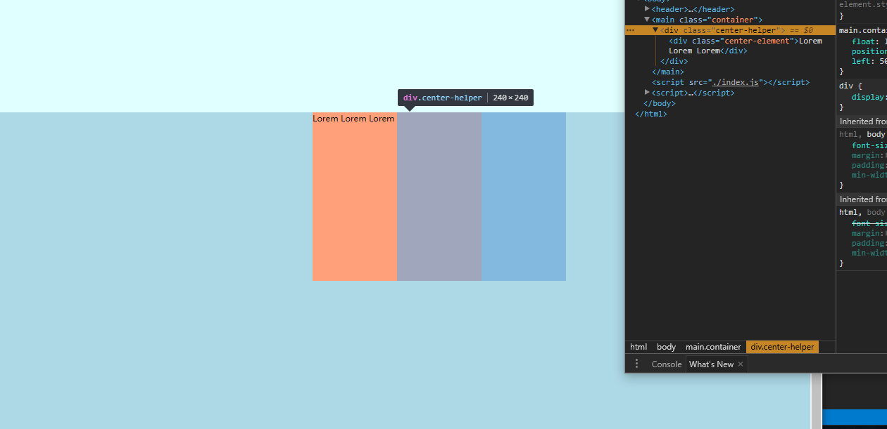

## 几种水平居中的方法

在做双飞翼布局的测试的时候，对于center元素内部的搜索框需要固定宽度并且水平居中。

```HTML
<header>
  <div class="center">
    <input type="text" />
    <div class="dropbox">
      
    </div>
  </div>
  <div class="left">
    
  </div>
  <div class="right">
    
  </div>
</header>
```

实现双飞翼布局的具体方法可以参考一下我的这个blog，[双飞翼布局](http://www.jianshu.com/p/5b5505fcc486)。

对象上面的这个样式，实现内部的`input`元素在中间的div中水平居中是有一定限制的。

水平居中在CSS样式中是非常常用到的一种方法，对于各种类型的元素，或者各种上下文的元素来说，进行水平居中的方法可能都不一样。目前使用的水平居中方法主要由下面几种。

### margin

最常用的，对于父元素固定宽度的元素来说，使用`margin: 0 auto;`能够快速进行水平居中，而且这种居中方法还是自适应的。

```html
<main class="container">
  <div class="inner">
  </div>
</main>
```

```css
main.container {
  background: lightblue;
  width: 60rem;
  height: 40rem;
}
main.container > div.inner {
  background: lightcoral;
  width: 20rem;
  height: 20rem;
  margin: 0 auto;
}
```



这种方法实现的结果是上面这个样子的。*但是，这个居中方法要求父元素的宽度是固定的*，这样才能够自动计算出来，子元素需要的`margin`，由于双飞翼布局中，`center`元素的宽度自适应，也就是`width: 100%`，那么这个居中方法是不能够使用的。

### inline-block & inline

对于行内类型的元素来说，可以为父元素添加`text-align: center`来快速将子元素居中到父元素中，但是这个方法需要子元素是行内元素，可以通过`display: inline-block`来设置。

HTML内容和上一条一样，只是给子元素中添加一行文本便于观察结果：

```css
main.container {
  background: lightblue;
  width: 100%;
  height: 40rem;
  text-align: center;
}
main.container > div.inner {
  /* 这里也可以设置为inline，效果不一样 */
  display: inline-block;
  background: lightcoral;
  width: 20rem;
  heigth: 20rem;
}
```

如果使用`display: inline`会导致的问题在于行内元素无法进行宽度的设置，所以子元素只会因为文本的宽度被撑开。

设置子元素为`display: inline`的效果：


如果使用`display: inline-block`，则可以解决大多数问题，包括`margin: 0 auto`会因为父元素的自适应而无法计算偏移量，所以无法居中，`inline-block`的方法，可以解决这个问题。

设置子元素为`display: inline-block`的效果：



但是，如果有两个元素都需要居中，那么这样就会产生新的问题：*`display: inline-block;`会导致两个子元素被放到同一行*，这样可能不是我们需要的结果。

同时拥有两个子元素，并且都设置为`inline-block`的效果：



### 基于BFC的hack方法

首先，要了解什么是BFC，以及BFC在进行居中的时候到底是起了什么作用。

[了解BFC看这里](http://www.jianshu.com/p/5b5505fcc486)

这里的居中是基于BFC产生的效果的这一条：

> BFC在计算高度的时候，浮动元素也会参与计算。
>
> BFC是一个独立的渲染容器，其内部元素不会影响到外部的渲染。

由于BFC的大小完全是基于其内部元素的决定的，如果我们给需要居中的元素外面嵌套一个额外的辅助元素，这个辅助元素设置为浮动，也就是生成了一个BFC，这样，外部元素的大小完全和内部需要居中的元素大小一致：

```html
<main class="container">
  <div class="center-helper">
    <div class="center-element">
      Lorem Lorem Lorem
    </div>
  </div>
</main>
```

下图中可以看到`.center-helper`BFC的大小是和其内部元素一致的：



那这和居中又有什么关系呢？

首先我们将外面的`.center-helper`向右偏移50%，这样得到的结果就是，我们需要居中的元素被偏移了父元素的50%，这样还需要将居中元素向左偏移其宽度的50%。这时候`.center-helper`元素就起作用了，由于其宽度和内部的需要居中的元素一致，那么只需要将内部元素向左偏移50%。也就是`.center-helper`宽度的50%，就可以进行居中了。

```css
main.container {
  width: 100%;
  height: 40rem;
  background: lightblue;
}
main.container > div.center-helper {
  /* 生成一个BFC */
  float: left;
  /* 偏移 */
  position: relative;
  left: 50%;
}
main.container > div.center-helper > div.center-element {
  height: 20rem;
  width: 20rem;
  background: lightsalmon;
  /* 偏移 */
  position: relative;
  right: 50%;
}
```

结果是这样的，可以看到，wrapper元素其实是为了进行辅助偏移的，让居中元素获取到其自己的宽度来进行偏移。



这个hack方法基本没有什么太大的缺点，但是需要理解其原来才可以更好的在项目中使用。并且具有比较高的浏览器支持率。

### flex布局实现

基于CSS3的弹性布局flex，可以最简单地实现居中，无论是水平居中，或者是垂直居中都非常方便。在未来，这个方法对于很多布局问题，都有着非常简单的解法。但是现在的浏览器支持率还并不是很完善。

下面几行代码就快速实现了垂直居中+水平居中。

```css
/* 方法1：flex布局的margin: auto不仅仅是水平居中，还有垂直居中 */
main.container {
  background: lightblue;
  height: 40rem;
  width: 100%;
  display: flex;
}
main.container > div.center {
  background: lightcoral;
  height: 20rem;
  width: 20rem;
  margin: auto;
}
/* 方法2：flex布局的标准布局方式 */
main.container {
  background: lightblue;
  height: 40rem;
  width: 100%;
  display: flex;
  justify-content: center;
  align-items: center;
}
main.container > div.center {
  background: lightcoral;
  height: 20rem;
  width: 20rem;
}
```

### `calc`方法实现

这是支持率最低的方法，但是用起来也非常简单。

```css
main.container {
  background: lightblue;
  height: 40rem;
  width: 100%;
}
main.container > div.center {
  background: lightcoral;
  height: 20rem;
  width: 20rem;
  margin-left: calc(50% - 100px);
}
```

### 总结

上面的这些方法，都是需要基于环境来进行选择的，是否放弃低版本的浏览器，或者是其内部的内容有相应的要求，都需要进行选择，但是大体上实现的效果是一致的。