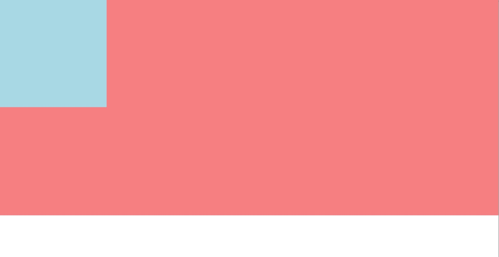

## 双飞翼布局和BFC

之前看到了一些面试题中，面试官会问到如果实现双飞翼布局或者是圣杯布局，这两个布局的理念基本是类似的，也就是中间的元素自适应，而左右两边的元素实际上是固定宽度的，也就是当减少页面宽度的时候，两侧的元素的宽度不变，而中间元素宽度减小。

而这个布局又要求中间的元素首先渲染，这样，在HTML中，元素的排版顺序应该是这样的：center,left,right，这样才可以保证中间元素首先渲染。

而为了实现双飞翼布局，那么需要用到`margin`和BFC相关的理论。

### 双飞翼布局的实现

双飞翼布局的HTML代码：

```HTML
<body>
  <div class="container">
    <div class="center"></div>
    <div class="left"></div>
    <div class="right"></div>
  </div>
</body>
```

#### flex

最简单的实现，也是在未来全局最优的实现方法肯定是CSS3提供的flex布局方式。弹性布局就是为了实现这样的自适应要求而生的。

使用flex布局实现双飞翼效果的重点有下面几个：

1. 因为元素在DOM中的顺序是center -> left -> right，所以需要在渲染的时候对排列的顺序进行修改。
2. 左右侧固定宽度。
3. 中间的元素需要自适应。

综合上面三点，可以用下面的CSS来实现双飞翼布局。

```css
.container {
  display: flex;
  height: 200px;
  /* 主轴上的对齐方式，由于左右要紧贴viewport的边缘，所以使用两端对齐的方式 */
  justify-content: space-between;
}
.left,
.right {
  height: 200px;
  width: 200px;
  background: lightblue;
  /** 由于左右两侧的元素宽度是固定的，
  	* 所以这两个元素的缩小比例应该设置为0，表示不进行缩小
    */
  flex-shrink: 0;
}
/** 使用flex布局的order属性，来对元素的顺序进行重新排列，是原本的第一个元素center
  * 排序到第二位。
  */
.center {
  height: 200px;
  order: 2;
}
.left {
  order: 1;
}
.right {
  order: 3;
}
```

flex布局的优点在于对未来版本的兼容性，并且flex布局本身就是为了实现弹性布局，对于一些其他的需求也可以进行很好的扩展。

但是其现在对于浏览器的支持率还是有些差，具体支持情况可以看[flex布局的浏览器支持情况—from caniuse](http://caniuse.com/#search=flex)

#### 使用浮动

目前使用的最多的方法还是利用BFC和负margin进行的。对于`margin`这个属性的一些细微内容的说明可以见[CSS margin相关]()

这个方法的思路是这样的：

首先需要将这些块级元素放到同一行中，为了保证不对其内部的效果产生比较大的影响，还是使用`float`来对元素进行浮动，而不是使用`inline-block`。

由于center元素需要自适应，那么其宽度应该是按照比例进行的，那么左右两侧的元素需要固定宽度，所以center元素只能够使用100%宽度，然后想办法将left和right元素位移到上一行。

下面这些代码是毫无疑问的，也是双飞翼布局的基本代码：

```css
.container {
  height: 200px;
  width: 100%;
}
.center {
  height: 200px;
  width: 100%;
  float: left;
}
.left,
.right {
  height: 200px;
  width: 200px;
  background: lightcoral;
  float: left;
}
```

现在得到的效果是这样的，需要将两个元素移到自已应该在的位置。


将元素进行位移的方法有很多，主要使用的是三种，`transform: translate();`，使用`position`进行定位，使用负`margin`。

首先第一个，`transform`根本上还是对元素进行变换的，也就是说，它不会改变元素在文档流中的位置，这就意味着它还是会占据本来的位置，pass。

先说明后两个方法都是可以实现这个效果的。

##### 使用position偏移

`position`可以为父元素添加`relative`属性值，然后为子元素添加`absolute`属性值，让三个子元素根据父元素进行定位。然后为center元素添加一个固定的`padding`，来为left和right腾出位置，这样就实现了双飞翼布局。

```css
.container {
  position: relative;
}
.center {
  padding: 0 200px;
  box-sizing: border-box;
}
.left {
  position: absolute;
}
.right {
  position: absolute;
  right: 0;
}
```

上面的代码和之前的代码结合就可以看出来效果了。重点在于设置center元素的盒子模型，因为center元素本身的宽度需要占据整个父元素来实现自适应，我们知道现代浏览器的盒子模型都是content-box，也就是width属性值表示内容的宽度，这样导致了设置padding之后，center元素会溢出viewport。将其设置为border-box，也就是将padding和border都包含在了width的宽度中。并且为左右侧元素腾出了空间。

然后使用根据父元素定位，将左右侧元素偏移到自己的位置，这个没有什么问题。Orz

##### 使用负margin偏移

将`margin`设置为负值，也可以将元素从文档流中偏移其本身的位置。

当然这个效果也需要使用`border-box`来让center元素给“左右护法”腾地方。

```css
.center {
  padding: 0 200px;
  box-sizing: border-box;
}
.left {
  margin-left: -100%;
}
.right {
  margin-left: -200px;
}
```

这里要注意下，为什么右侧元素只需要偏移200px就可以上去了，因为左侧元素首先偏移了整个横轴，被放到了文档流的前面，那么右侧元素在文档流的位置就是原本左侧元素的位置，所以只需要偏移200px。

但是，但是，如果左侧元素不进行偏移，那么右侧元素无论如何设置`margin-left`，都是不能够向上偏移的。

重点在于每个浮动元素都会生成一个新的BFC，有着自己的上下文，而每个浮动的BFC之间是挨个排列的，如果其左侧元素没有偏移到上一行，那么其负margin进行的偏移仍旧是在当前行中进行的，如果仅仅对右侧元素进行-400px的偏移，那么该元素会直接溢出，而不是被偏移到上一行中。

##### 使用calc进行直接计算

最最简单，也是当前浏览器支持率最低的实现方法，可以使用CSS新标准提供的`calc`函数来直接计算center元素的宽度，这样连`border-box`都不需要设置了。

这个方法也需要`margin`的一点小小的帮助来hack。

```css
.center {
  width: calc(100% - 200px);
  margin-left: 200px;
}
.left {
  margin-left: calc(200px - 100%);
}
```

三行CSS属性就可以得到需要的效果了。当然这些代码都需要和上面的基本代码组合起来。

#### 结果

上面的这些方法的组合或者是单独的方法实现的效果都是一致的，就是文章开头提到的DOM顺序为center、left、right，显示顺序为left、center、right。center元素自适应，left、right元素固定宽度。

效果如下：


这些方法都有着自己的优点和缺点，需要根据自身使用情况来决定使用哪种方法来实现。

### BFC

提到了浮动，就需要对BFC进行一些简单的解释。

浏览器对于DOM树的渲染是基于CSS样式规则来生成render树的，每个render树的节点都是一个矩形的元素，这些元素被按照一定顺序排列到viewport中，然后来进行绘制的。

那么这些矩形的元素之间的关系是什么样的呢，这些矩形的元素进行渲染的时候有相应的渲染规则，这个规则就是上下文。

每个矩形元素根据其样式的不同，会被分配到不同的类型，这个类型叫做`Formatting Context`。BFC中的B代表着这个上下文是块级元素的上下文，所以BFC的全称应该是`Block-level Formatting Context`。

块级上下文是根据一些CSS定义的：

* 根元素。


* `float`属性不为`none`，也就是浮动元素。
* `position`为`absolute`或者`fixed`，也就是脱离文档流的元素。
* `overflow`不为`visible`，也就是内容不会溢出。

这些元素被按照该上下文进行渲染，生成严格的矩形。

#### BFC的渲染规则

* BFC内部的元素按照垂直顺序，一个接一个的排列。
* BFC内部的元素的border-box和BFC本身的左侧margin相接。
* BFC的区域在自然情况下不会和其他的BFC重叠。
* BFC是一个独立的渲染容器，其内部的元素不会影响到外面的元素。
* BFC计算高度的时候，浮动元素也会参与计算。

#### 使用

##### 清除浮动

看到上面渲染规则的最后一点，肯定很多人都会有一个大胆的想法，就是清除浮动，浮动的元素会在成其父元素不能够撑开高度，这是一个普遍的问题，在现在的CSS开发环境下，很多时候都会使用浮动来对元素进行布局。清除浮动也是一个比较关键的技术。

还是用上面的双飞翼布局的三个元素进行测试：

```css
.container {
  width: 100%;
  background: lightblue;
}
.center,
.left,
.right {
  height: 200px;
  float: left;
}
.center {
  width: 100%;
}
.left,
.right {
  background: lightcoral;
}
```

这时候，父元素的高度不会自动被子元素撑开，需要手动设置父元素高度才可以，下面的图中可以看到父元素的高度为0，并且父元素的背景色也没有被渲染出来：


为了自适应子元素高度，让父元素自动被撑开高度，基本上常用的方法是给父元素添加一个伪元素，然后对伪元素应用`clear: both;`来清除浮动的副作用，使用BFC有一个简单的办法，直接将父元素设置为BFC，这样根据上面的：

> BFC计算高度的时候，其内部的浮动元素也会参与计算。

父元素的高度也可以被撑开。生成一个BFC的方法有很多种，可以根据自己的需求选择一个：

* 如果父元素本身也需要浮动，那么其本身就会变成BFC。
* 如果父元素需要定位，那么可以借用`absolute`或者`fixed`的副作用。
* 如果需要side-effect最小，那么可以设置其`overflow`。

下面的几种方法都可以达到清除浮动的效果：

```css
/* 方法1：常用方法，伪元素配合clear: both */
.container::after {
  content: '';
  display: block;
  clear: both;
}
/* 方法2：减小副作用 */
.container {
  overflow: hidden;
}
/* 方法3：设置父元素浮动 */
.container {
  float: left;
}
```

基本的伪元素方法有一个小缺点在于，当前环境下CSS的伪元素作用很大，而且伪元素只有两个，用一个少一个，还算比较珍惜的东西，用来清除浮动稍微有点浪费，但是好处在于这个方法基本没有任何的side-effect。

##### 两侧布局

如果有两个元素：

```html
<div class="left">  
</div>
<div class="main">
</div>
```

我们需要将left元素放到左边，并且main元素放到右边，并且main元素宽度自适应，如果不考虑一些比较麻烦的方法，我们会考虑的应该是给left元素添加左侧浮动。



得到的结果是这样的，main元素被left元素覆盖了一部分，如果想要main元素可以只占据自己的那一侧：

> BFC在自然情况下不会和其他BFC重叠。

左侧的float自然是一个BFC，那么将右侧main元素变成BFC的方法也就有很多了，都是一样的效果。

但是这里不能对右侧元素使用浮动，因为其并未指定宽度，使用浮动会导致其无法撑开。这里使用:

```css
.main {
  overflow: hidden;
}
```

就可以实现这样的效果了：


#### 结论

BFC理论初次看来对于我们可能没有什么帮助，但是细细深究下去，我们平常的很多实现都是依据标准中的BFC来进行的。即使不知道在使用，也是离不开的，对于其深入的了解可以让我们在使用中找到很多的hack方法，并且更好的理解浏览器对于页面的绘制过程。