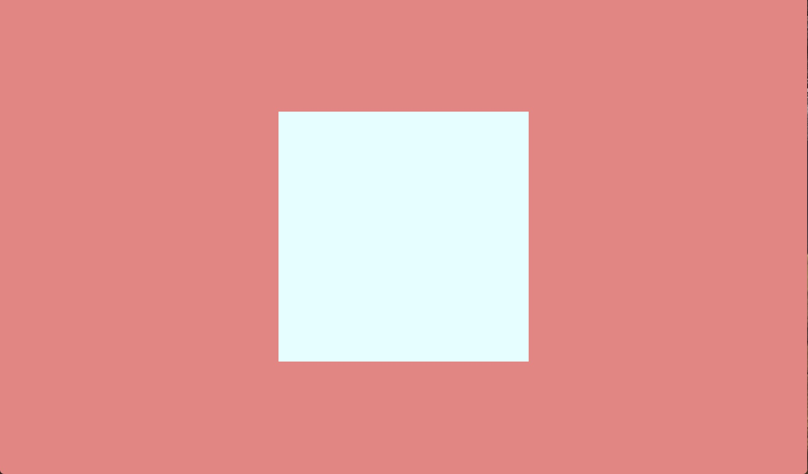

## 垂直居中

垂直居中的难度相对于水平居中要高一些，而且很多都是在特定的条件之下才可以进行。

### position

这个方法和水平居中的方法类似，所以这个方法可以和水平居中的方法一起使用，来实现垂直水平居中。

这个方法基本没有任何限制，只要是两个嵌套的元素就可以了，但是需要设置两个元素的`position`，如果不想要设置`position`的话，那么不可以使用这种方法，比如已经对于外部元素设置了`position: fixed`，那就不能够使用这种方法了。

对于下面这样的一个页面：

```Html
<div class="container">
  <div class="internal">
  </div>
</div>
```

是两个嵌套的div块级元素，然后需要让外部的元素占满整个视口，内部的元素固定大小并且在外部元素中水平和垂直居中。

```Css
body, html {
  margin: 0;
  height: 100%;
}
.container {
  height: 100%;
  width: 100%;
  background: lightcoral;
  position: relative;
}
.internal {
  height: 300px;
  width: 300px;
  background: lightcyan;
  position: absolute;
  top: 50%;
  left: 50%;
}
```

首先需要让内部元素根据外部元素进行定位，当然最先联想到的就是设置外部元素的`position: relative`，然后让内部元素根据父元素进行定位，也就是`position: absolute`。

这时候internal元素的左上角的位置就是container的中心，然后让内部元素进行偏移，也就是让internal元素再往左上方向偏移其本身宽度和高度的50%。

这里可以使用`transform: translate`来实现，这个方法使用百分比偏移是基于其本身的宽度和高度的，这样，如果对其设置一个负的值，那么就是往左上偏移了。

给上面的internal元素添加一个`transform: translate(-50%, -50%);`就可以了。

得到的效果是这样的：



*这个方法的优点在于不需要其他的辅助元素，而且可以在百分比自适应的情况下进行居中，不需要知道元素本身和容器元素的宽高值。并且垂直和水平居中可以一起进行，但是却要占用元素的position属性。*

当container元素中只包含internal一个元素的时候，可以直接对internal元素设置`position: relative`，然后再加上偏移和transform就可以实现居中了，使用`absolute`主要是为了防止container元素内部有多个元素的时候，影响正常布局。

### flex布局

flex布局自适应的终极解决方案，也是可以同时用来进行垂直和水平居中的方法，并且flex布局的功能不仅仅是这样，主要是实现多行弹性布局的。

如果container元素内部仅仅有internal一个元素，那么实现水平垂直居中的话只需要一行代码就可以了。

HTML代码和上面的一样，CSS：

```css
.container {
  background: lightcoral;
  height: 100%;
  width: 100%;
  display: flex;
}
.internal {
  background: lightcyan;
  height: 300px;
  width: 300px;
  margin: auto;
}
```

这是最简单的实现水平垂直居中的方法，在flex元素内部，`margin: auto`不仅仅可以实现水平居中，还可以实现垂直居中，并且无论父元素的宽高是固定值还是百分比。

如果需要用更规范的定义来实现的话：

```css
.container {
  display: flex;
  align-items: center;
  justify-content: center;
}
```

*flex布局的缺点就是浏览器支持率问题，如果在确定不需要支持低版本浏览器的情况下，那么flex布局一般都是这种弹性布局方式的最优解决方案，如果面对的首要目标是移动端的话，那么flex布局在移动端的支持率要好于在桌面端。*

### 文本居中

对于行内元素，其文本是自然在行内居中的，但是对于块级元素内部的文本来说，如果没有指定container的高度，那么container会被自动撑开，但是大多数情况下都需要指定容器元素的高度的。这时候文本就会生成一个匿名的inline box，然后在container元素内部靠着top水平排列，如果有其他的具名inline box，比如`<span>`、`<em>`等，就会生成多个inline box。

#### 单行文本

单行文本的垂直水平居中是比较方便的。

只需要设置和container元素的高度一致的行高即可。其实这里也不需要设置`height`，只需要设置`line-height`就可以了，因为container元素的`height`会被`line-height`自动撑开。

这里稍微说一下行高。之前说到了inline box，这些inline box会组成一个line box，每一行生成一个新的line box。line box的高度其实就是由文本的行高确定的，也就是`line-height`属性。所以当一个块级元素未设置height的时候，其高度是由内部文本的line-height来撑开的。

而对于某一行文本来说，也就是在同样的inline box内部，其line-height中线会作用域内部的所有inline，所以其内部所有的inline box内容都会将inline box的行高中线作为其本身的中线，这样就实现了文本在其中自然水平居中。

```css
.container {
  line-height: 300px;
}
```

对于单行文本来说，由于行高会直接撑开container元素的高度，那么可以直接设置line-height来利用line box的自然居中。

#### 多行文本

多行文本也有很多种情况，如果父container不需要指定高度的话，那么只需要给container设置一个padding，就可以得到垂直居中的视觉效果了。

```css
.container {
  line-height: 20px;
  padding: 100px;
}
```

这样的高度会被自动撑开，文本的行高和元素的padding加起来就是容器元素的视觉上的高度了。

如果容器元素需要有固定的高度，那么就不能够进行高度的自动撑开了，可以利用line-height的hack实现。

由于容器元素的高度可以由内部的line box完全撑开，那么需要设置一个用来撑开container元素的元素，可以称这个元素为fake element，然后将整个文本块作为`inline-block`元素，fake element由于是一个不占据任何位置的元素，所以其会和文本块位于同一行，由于自然居中效果，fake element实际上是位于整个container元素的中线的。那么只需要设置文本块为`vertical-align: middle;`将两个元素的中线对齐，那么就可以得到最后的结果。那就是多行文本的中线在container元素中垂直居中。

上面的方法的重点在于：

* fake element：撑开container高度，自然居中。
* `inline-block`：将整个文本块最为一个整体进行操作。
* `vertical-align: middle`：将fake element和文本块中线对其。

实现的代码：

```html
<p>
  <span>This is the first line.</br>
  This is the next line to test the vertical align.</span>
<i id="fake-element">&nbsp;</i>
</p>
```

```css
p {
  height: 300px;
}
#fake-element {
  line-height: 300px;
  font-size: 0;
}
p span {
  display: inline-block;
  vertical-align: middle;
}
```

#### 文本居中的实际应用

文本的居中在很多情况下都可以使用，比如在我们常见的博客或者论坛页面中，可能需要在一行之中含有头像和用户名两个元素，并且让这两个元素居中显示：

```html
<div class="author">
  
  <span>Lucas Twilight</span>
</div>
```

```css
.author {
  /* 设置行高可以让其中的文本实现垂直居中 */
  line-height: 200px;
  width: 200px;
}
img {
  /* 调整一下图片的对其方式，img标签的默认格式为inline-block，可以接受vertical-align属性 */
  vertical-align: middle;
  width: 50px;
  height: 50px;
}
span {
  font-size: 20px;
}
```

这里实现了两个元素的居中，一个是单行文本，其实img元素也可以算是inline，所以设置行高也会影响到img的位置。对于图片的inline-block格式，应用`vertical-align`可以实现其垂直居中。

[文本垂直居中的实际应用](http://jsbin.com/sujimudoza/1/edit?html,css,js,output)

