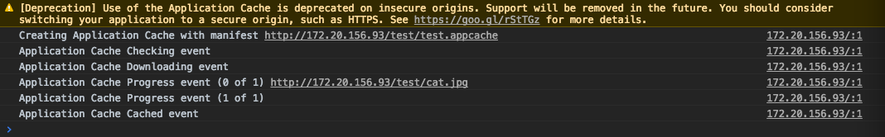

## HTML5应用程序缓存及DOCTYPE标签

### HTML5 application cache

除了IE之外的所有主流web浏览器都支持应用程序缓存，并且这种技术是不存在降级压力的，即使浏览器不支持应用程序缓存，也不需要设计专门的代码对其降级，无非是体验不到缓存的加速功能而已。

application cache和一般的缓存比起来，基本没有特别大的差别，只是对于离线应用的效果要好很多。

#### 例子

如果需要启动应用程序缓存，需要在文档的HTML标签中包含`menifest`属性。

```html
<!DOCTYPE HTML>
<html manifest="demo.appcache">
</html>
```

每个指定了`manifest`的页面在用户对其访问的时候都会被缓存，没有指定`manifest`的页面如果在`manifest`文件中被显式指定，也会被缓存。

首先，`manifest`文件需要在web服务器上进行配置，必须设置成正确MIME类型，需要在服务器的`MIME`的配置文件中添加一个新的类型。

比如，在Apache2中可以这么进行设置：


`manifest`文件是简单的文本文件，可以告诉浏览器被缓存的内容。`manifest`文件可以分为三个部分：

* CACHE MANIFEST：该标题下面列出的文件将在首次下载之后进行缓存。
* NETWORK：这个标题下面列出的文件需要和服务器进行连接，并且不会被缓存。
* FALLBACK：这个标题下面列出的文件规定，当页面无法访问时候的回退页面，也就是404页面。

写一个比较简单的DEMO：

```html
<!DOCTYPE HTML>
<html manifest="test.appcache">
  <head>
    <title>
      Application Cache Demo
    </title>
  </head>
  <body>
    
  </body>
</html>
```

```
CACHE MANIFEST
./cat.jpg
```

在访问该页面的时候，控制台中会显示缓存情况。



注意到最前面的`Deprecation`提示，提示中表示HTTP中的应用程序缓存已经将要被废弃，只有来自于安全的源的缓存才能被Chrome接收，也就是通过HTTPS接收的请求会被缓存。

`manifest`文件的第一个部分`CACHE MANIFEST`是必须的，表示即使用户断网了，那么缓存的资源仍然可以使用。

第二个部分`NETWORK`部分规定的文件是必须要通过网络来进行加载的，如果设置为`*`，那么表示出了显式进行缓存的文件外，其他所有文件都需要进行网络请求。

第三个部分`FALLBACK`表示离线状况下的替代操作。就例如可以缓存一个404页面，当用户离线访问某个子域名的时候，会用这个404页面代替原来的默认404页面。

#### 缓存的更新

有时候文件的内容发生了修改，但是这时候`manifest`文件并没有被修改，在这样的情况需要更新缓存的话，可以修改`manifest`文件的注释行，注释行的修改也会导致缓存重新加载。

### DOCTYPE

`DOCTYPE`声明是在HTML文档的第一行，在HTML标签之前，指示web浏览器渲染时候使用的HTML版本。HTML4需要引入DTD而HTML5不需要。

始终都要对HTML文档中添加`<!DOCTYPE>`声明，这样浏览器才能够获知文档类型。

```html
<!-- HTML 5 模式，不需要使用DTD -->
<!DOCTYPE HTML>
<!-- HTML 4.01 的严格模式，需要指定DTD -->
<!DOCTYPE HTML PUBLIC "-//W3C//DTD HTML 4.01//EN" "http://www.w3.org/TR/html4/strict.dtd">
<!-- XHTML 1.0 的严格模式，也需要使用DTD -->
<!DOCTYPE HTML PUBLIC "-//W3C//DTD XHTML 1.0 Strict//EN" "http://www.w3.org/TR/xhtml1/DTD/xhtml1-strict.dtd">
```

