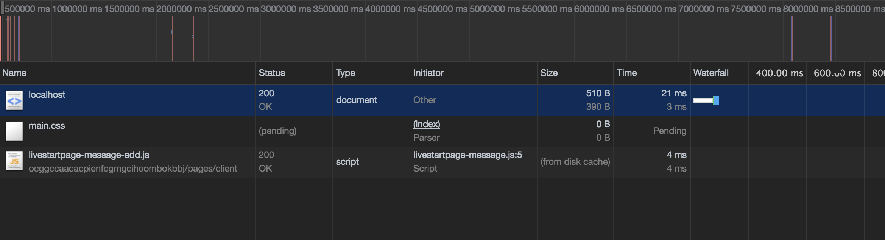
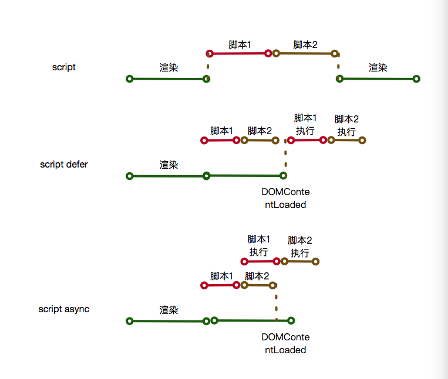
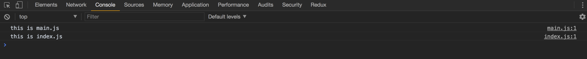
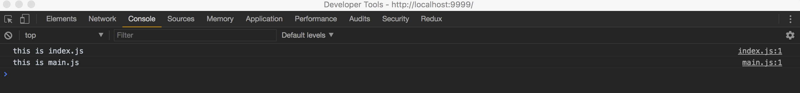

## defer & async

### 前提

在说defer和async两个`script`标签的属性之前，要先说一下浏览器对于页面进行加载的流程，浏览器渲染页面是基于两棵树进行的，分别是DOM树和render树，DOM树由HTML决定，HTML元素会被解析为一个个节点，自上而下形成一棵树；而render树是由CSS和DOM树决定的，每个节点在接收了CSS之后，会根据其所占据的空间，形成一棵render树，render树和DOM树是具有映射关系的，但是节点却不一样，比如设置`display: none`的元素是不具有render树节点的，render树决定的是显示在视口中的元素。

1. 当输入网址，发出一个请求，并且服务端响应了HTML文件，这时，浏览器会对HTML文件进行解析，来逐步生成DOM树。
2. 如果浏览器在解析HTML文件的时候遇到了外部资源，则会发送请求，来向服务器请求该外部资源。
3. 如果资源是`script`脚本文件，那么DOM树的构建过程会被阻塞，直到脚本加载并且执行完毕，才会继续进行DOM树的构建。
4. 其他资源会进行异步请求，在构建DOM树的过程中，也会同时进行render树的构建。
5. render树中的内容，会被布局和绘制到页面中。

那这里面有两个问题，JavaScript会阻塞页面的渲染，是如何阻塞的？CSS是否会阻塞页面的渲染呢？

### 测试的服务器端

使用NodeJS写一个简单的服务器来进行调试：

```javascript
const http = require('http');
const fs = require('fs');
const SysPath = require('path');

const server = http.createServer((req, res) => {
  const path = req.url;
  console.log(`request file is ${path}`);
  let filePath = '';
  if (path === '/') {
    filePath = './index.html';
  } else {
    filePath = SysPath.join('./', path);
  }
  const readStream = fs.createReadStream(filePath);
  readStream.on('error', function(error) {
    res.statusCode = 404;
    res.end('file is not found');
  });
  // 这里可以选择需要延迟返回的文件，现在设置为根目录的html和index.js脚本
  // 两个元素可以直接进行返回
  if (path === '/' || path === '/index.js') {
    res.statusCode = 200;
    readStream.pipe(res);
    return;
  }
  setTimeout(function() {
    res.statusCode = 200;
    readStream.pipe(res);
  }, 5000);
});

server.listen('9999', function() {
  console.log(`server is listening in port 9999!!`);
});
```

### CSS的延迟加载情况

使用上面的服务器，请求HTML，并且将CSS引入的部分放到`head`标签中：

```HTML
<head>
  <link href="./main.css" rel="stylesheet" />
</head>
```

可以看到，当样式表被阻塞的时候，页面的渲染也被阻塞，虽然之前div已经有了其他的样式，但是这些样式仍然不能被渲染出来。



### JavaScript阻塞

JavaScript会阻塞页面的渲染大家基本上是都知道的，JavaScript会完全阻塞页面的同步渲染，为了防止这种情况发生，加快首屏显示的速度，标准里面给出了两种异步加载脚本的方法。

其中一个是`defer`，这个是在HTML5之前就实现了的，这个属性可以让这个外联脚本在另外一个线程中进行请求与加载，然后等待DOM树构建完成，再执行脚本。

而`async`和`defer`类似，都是在另外一个线程中进行脚本的加载，但是不同点在于，`async`会在脚本加载完成之后立刻进行执行。当然，脚本在执行的时候仍会阻塞掉浏览器渲染的主进程。

大概的加载流程就和下面这个图一样：



但是`async`有一个很大的缺点在于，当有多个脚本同时标注为异步脚本，那么这些脚本均会在其被加载完成后直接执行，这样由于某些脚本的加载速度比较快，有些脚本的加载速度慢，会导致脚本的执行顺序和预料当中的不一致，所以有依赖关系的脚本尽量不要使用`async`进行加载。

而`defer`脚本由于是在DOMContentLoaded事件触发之后开始执行，所以脚本的执行顺序也是严格按照脚本的引入顺序进行的。

这些延迟都是针对外联脚本的，而内联脚本则不受这个属性的影响，内联脚本会直接执行，并且阻塞页面的渲染进程。

### 延迟脚本的执行顺序

可以修改一下服务端的代码对执行顺序进行一下验证：

```javascript
if (path === '/') {
  res.statusCode = 200;
  readStream.pipe(res);
  return;
}
// 对于main.js进行5s的延迟，对于index.js进行2s的延迟
let delay = 2000;
if (path === './main.js') {
  delay = 5000;
}
setTimeout(function() {
  res.statusCode = 200;
  readStream.pipe(res);
}, delay);
```

HTML中先加载延迟较大的main.js，在加载延迟较小的index.js

两个脚本都添加defer，虽然main脚本延迟了5s才加载完成，但是index脚本会等待main脚本完成之后，再进行执行：



两个脚本都添加async，由于index脚本只延迟了2s，在浏览器接收到了index脚本之后，会对其进行立即执行，这样*就打乱了正常的脚本执行顺序，可能会导致相互依赖的脚本发生错误。*：



### 结论

当需要使用延迟加载的脚本的时候，需要考虑这些脚本之间的依赖关系，由于render树布局的原因，所以对于一些需要操作DOM的脚本来说，如果对其进行延迟加载，那么在页面渲染完毕之后，再进行一些会影响布局的DOM操作，这样会造成页面的reflow或者repaint，会有非常不好的影响。