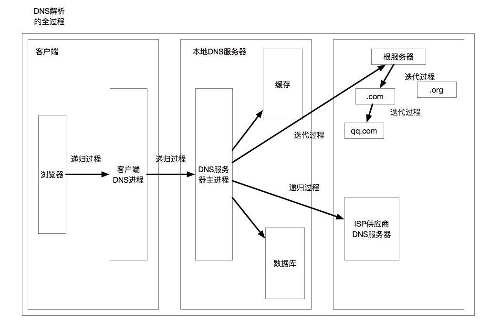

## DNS和域名收敛

### DNS

当在浏览器中使用一次HTTP请求的时候，资源的URI一般都是使用下面这种格式来表示的：

`http://www.baidu.com/index.html`

除去后面对于资源进行定位的部分，以及最前面使用的协议标识，剩下的部分就是合法的域名部分。也就是`www.baidu.com`。

这个域名就代表资源所在的位置。由于HTTP是应用层协议，具体的通信还是需要使用网络层协议TCP来进行，但是TCP不能够识别域名，而是使用IP地址来进行通信的，所以这里需要将域名转换为IP地址来进行请求。而DNS就是为了这个而生的。

DNS全名Domain Name System，是一种有层次的，分布式的数据库系统，当需要进行域名解析的时候，就通过这个系统来获取域名对应的IP地址，也就是发送一个DNS请求。

#### DNS解析过程

在每个客户端中，包括移动端设备、个人电脑、服务器等，都会运行一个DNS进程，这个进程有着自己的缓存，当客户端需要进行一次域名解析的时候，会从URL中抽取域名字段，也就是主机名，然后将主机名发送到DNS进程，DNS进行会首先在其内部的缓存中查询该域名对应的IP，如果存在这个映射，那么可以直接使用这个IP地址。

如果客户端DNS缓存中不存在该映射，那么就需要向客户端网络配置中的本地DNS服务器进行一次DNS请求。

本地DNS也有着自己的数据库和缓存，如果本地DNS的数据库或者缓存中具有这一对儿域名和IP地址的映射，那么就将这对映射返回给客户端的DNS进程。

如果本地DNS没有映射，那么就有两种方式了，如果使用转发模式，那么本地DNS服务器会向上级DNS服务器进行转发，上级DNS服务器如果仍旧没有得到相应的映射，那么就继续向上级转发，这个过程称为DNS的*递归查询*。

如果不采用转发模式，那么本地DNS会将请求发送到根DNS服务器，然后转发到13台顶级DNS服务器(.com .edu .org .gov等等)，13台顶级DNS服务器会根据其域名解析，然后将请求转发到下一级DNS服务器，这样迭代查找，直到找到当前域名的映射，这个过程称为DNS的*迭代查询*。 

```asciiarmor
// 迭代查询的过程
www.im.qq.com --> .com --> qq.com --> im.qq.com
```

根据下面的图可以看到`qq.com`的查找过程。



### 为什么需要域名收敛

当进行一次DNS查找之后，找到的这一对儿映射会被浏览器或者客户端DNS进程缓存下来，这个缓存的时间比较短，所以，如果将一个web应用的DNS限制到较少的几个域名之内，这样进行第一次查找的结果可以给未来的几个资源使用，减少的DNS查找的次数，因为DNS查找需要进行网络请求，这样可以明显地提高页面的加载速度。

尤其是在移动端，移动端使用的DNS解析由于是和运营商相关的，大部分情况下的DNS解析速度都比较慢，*所以对于移动端来说，域名收敛原则非常重要。*