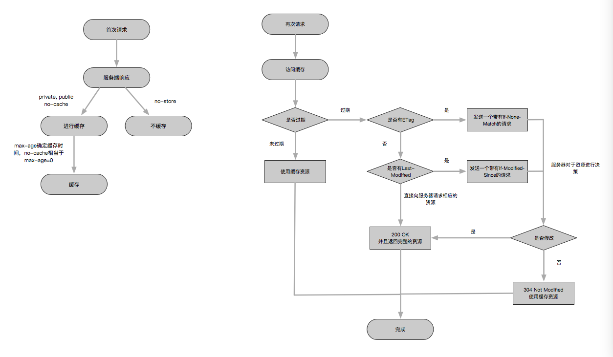

## HTTP缓存机制

下面的相关内容主要是针对HTTP请求头部的`Cache-Control`字段来进行设置的。还会有一些其他的首部字段。

### 缓存存储策略

用来确定HTTP的响应内容是否可以被客户端进行缓存，以及可以被哪些客户端进行缓存。

`Cache-Control`中的几个字段都是用来确定响应内容是否缓存到客户端的：

* `public`：仅客户端可以缓存，代理服务器不能够缓存。
* `private`：客户端和代理服务器都可以进行缓存。

上面两个缓存存储策略对于前端来说都是一致的，表示客户端可以对该资源进行缓存。

* `no-cache`：表示可以进行缓存，但是缓存会直接过期，相当于设置`max-age=0`。所以会强制要求验证。
* `no-store`：表示所有的内容都不会被缓存。

上面两个缓存存储策略的第二个对于前端非常不友好，所以基本很难用到，而第一个强制要求验证在有些时候是很有作用的。

所以基本上前三个缓存策略都可能会用到，前两个缓存需要过期策略来进行辅助操作，而第三个不需要，因为`no-cache`会要求强制进行缓存对比。

### 缓存过期策略

客户端需要确认缓存是否过期，来确定是否需要发送请求到服务端来获取数据，缓存过期策略就是确认客户端的数据是否能够使用。

并且`Cache-Control`中的过期策略的优先级要高于`Expires`首部所标记的优先级。

如果某个资源已经被缓存到了客户端本地，并且通过头部的缓存信息发现这个缓存还没有过期的话，那么就不会请求服务器来进行缓存的验证或者更新。

这里先说一下另外一个首部字段：

`Expires`：该首部字段的值为服务端返回的到期时间。这个时间是用服务器上的标准时间来表示的，由于服务器时间和客户端时间可能不一致，这样会导致缓存出现问题，并且这个首部在HTTP/1.1中已经完全被取代了，所以用的地方比较少。

下面是HTTP/1.1的`Cache-Control`首部的缓存过期策略字段：

`max-age`：这个字段表示当前资源的过期时间，从客户端缓存了该资源开始，一旦资源缓存的时间超过了这个时间，那么必须要向服务器进行资源验证。

`Cache-Control: max-age=604800`，这里的单位是秒。

### 缓存对比策略

如果缓存已经过期了，那么客户端的缓存数据标识会被发往服务端，服务端通过这个标识来判断客户端的缓存是否有效。来确定是否需要重新发送数据。

#### `Last-Modified`&`If-Modified-Since`

`Last-Modified`是响应首部，服务器会向客户端返回该资源的最后的修改时间，当客户端再次对于此资源请求服务器的时候，会使用`If-Modified-Since`首部，来将缓存该资源时候写入的资源最后修改时间发送给服务端，如果服务端上这个资源的最后修改时间大于`If-Modified-Since`所标记的时间，则返回一个新的资源内容。否则，响应304 Not Modified，表示浏览器可以使用该缓存。

#### `ETag`&`If-None-Match`

服务器响应请求的时候，会告诉客户端该资源在服务器上的唯一标识符ETag。当客户端缓存了该资源，并且该资源过期之后，客户端会发送一个`If-None-Match`请求，来告知服务端当前资源的标识符，如果这个标识符不同，那么会响应一个新的资源，否则，响应304 Not Modified，表示可以继续使用该缓存。

要注意的是这个首部的优先级要高于`Last-Modified`以及`If-Modified-Since`这一对儿缓存对比策略。

### Conclusion

最后的缓存流程可以看下图：

