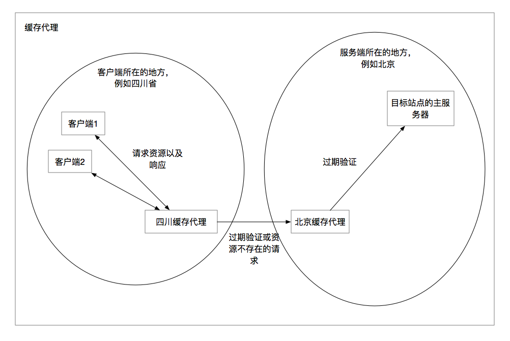
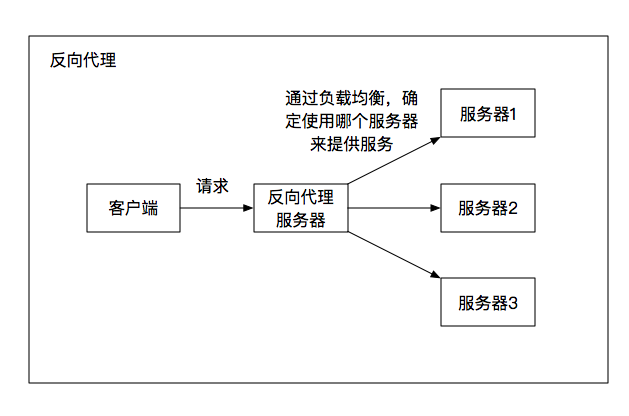
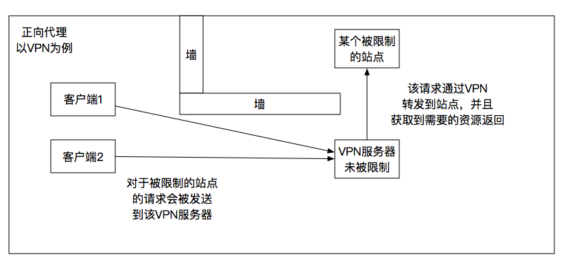

## HTTP代理

代理的实际作用类似于一个带有控制的转发服务器，代理在面对客户端的时候，起着服务器的作用，在面对服务器的时候，扮演着客户端的角色。

当使用代理的时候，如果代理是客户端的下一跳，那么客户端会将请求发送到代理服务器，然后代理服务器对于客户端的请求进行相应的处理（这个处理是根据代理的功能进行的），然后将相应的请求发送到下一跳。当代理服务器接收到当前请求的响应之后，将响应报文处理之后发回到客户端。

> 代理就是在两个端点之间传递报文。

## 代理的作用

每个代理都有着其自己的业务功能，现在的互联网环境下，很多代理服务器都不仅仅有一项功能，可能负载着多种业务需求。

### 缓存代理

最常使用的代理服务器，应该就是缓存代理了。当客户端请求一个资源的时候，在客户端和服务端两个端点之间，可能存在着一个代理服务器，当请求报文到了这一跳的时候，代理服务器会检查自己的缓存中是否有当前客户端请求报文中所请求的URI资源，并且该资源是否过期。

如果资源过期或者没有该资源的缓存副本，那么代理服务器会向原始服务器请求该资源并且缓存下来。并将客户端请求的资源发送到下一跳。

比较大型的互联网公司都会在每个区域有自己的区域缓存代理，来提升用户资源的请求速度以及降低原始服务器的压力。



### 访问控制

在某些网络环境下，可能需要在网络内部与外部网络接口中进行访问控制，来防止客户端对于某些站点的请求，或者是对于某些站点的请求进行身份质询。这种情况下可以使用代理来对于内部网络进行访问控制。

在内网和外网的某个交汇点增加一个代理服务器，通过配置网络来让网络流量通过该代理，然后代理对于对应的请求进行分类并且限制。

### 反向代理

所谓的*正向代理是建立在客户端一侧，使得多个客户端在服务端眼里是同样的一个客户端，由代理来伪装该客户端*，一般的代理都是正向代理，比如我们经常使用的VPN。

对于某些网络环境下禁止访问的站点，可以在该网络环境之外搭建一个代理服务器。一些被禁止的网络请求会被发送到这个代理服务器，代理服务器作为客户端，来向目标站点请求相应的资源，然后将这些资源作为响应，返回给真正的客户端。

*反向代理刚好和正向代理相反，反向代理中，服务端对于客户端是透明的，在客户端眼中，代理服务器就是服务端。*反向代理一般用在需要对于资源进行负载均衡的时候。

当一个请求发送到了代理服务器，代理服务器会进行一次负载均衡，来判断将该请求报文发送到哪个服务端，并且将报文发出，客户端收到的响应报文是来自于全局最优的服务端提供的服务。

举个栗子，当我们到餐厅吃饭的时候，我们到前台点完餐，拿到自己那份汉堡的单子，就可以在座位上等着了。这个单子会被送到厨房，然后某位大厨会指定一个或者是最闲的，或者是做得最熟练的厨师来帮我们做这个汉堡。这时候，我们并不知道是哪位厨师给我们做得这个汉堡，但是当汉堡做完从后厨端上来的时候，我们就可以拿着自己的餐票去取了。前台以及后厨进行指派的大厨就相当于反向代理服务器，来负载均衡，为客户提供最好的服务。





## 客户端请求的方向

由于在默认的情况下，客户端请求的资源都是指向目标服务器的，如果要使用代理的话，需要让代理称为目标服务器和客户端之前的一跳，才有处理这个请求的机会。

- 对于客户端进行配置：以最常用的客户端实体浏览器为例，在浏览器中一般都会有直接配置代理的地方，这里可以对于全局代理进行配置，这样所有的请求都会经过代理的一跳。
- 通过路由进行配置：在请求经过路由转发的时候，通过配置路由来将请求发送到代理服务器。
- 修改DNS：对于需要使用代理的域名或者主机，将其DNS解析后的结果直接设置为代理服务器的IP，这样，在该DNS服务下，所有对于该域名的请求都会被发送到代理服务器。
- 服务器重定向：修改web服务器，使其对于本机的请求进行重定向，重定向到代理服务器上面去，但是这样原始服务器仍然需要对于该请求进行一次处理，并且还需要一次重定向的过程。

## URI问题

有些时候，客户端并不知道目标服务器是代理服务器，或者途中的某一跳是代理服务器。当客户端对于真正的代理服务器发起请求的时候，其URI中可能不会带有`Host`首部来指定目标主机，并且使用的是相对路径来进行访问。比如下面这个HTTP请求：

```
GET /index.html HTTP/1.1
User-Agent: DefaultAgent12
```

当代理服务器不知道这个请求到底是发往哪个主机的时候，就会出现一系列的问题。代理需要目标主机名才能够和目标主机建立连接，进行一系列的操作。

这个问题和虚拟主机比较类似，由于当前IPv4的地址量不足的问题，有些站点会使用同一个IP地址，通过路由来进行具体请求的转发，每一个主机站点其实都是虚拟的，并不是真实存在的IP。

主要的解决办法根据请求方式的不同，可以有两种：

对于显式的代理请求，比如重定向到代理或者是直接配置浏览器代理，这样的请求需要发送完整的URI路径。

对于非显式的代理请求，比如反向代理这种一般直接将代理作为服务器，客户端并不知道该请求是发往代理的，这时候需要添加一个`Host`首部来指示目标主机。然后如果代理需要目标主机的地址，可以通过该首部进行获取，或者通过DNS的反向解析，使用IP地址来解析请求主机。

完整的请求报文应该是这样的：

```
GET http://www.baidu.com:80/index.html HTTP/1.1
Host: www.baidu.com
User-Agent: Default-Agent123
```

## 其他

### Via首部

Via首部可以规定在两个端点直接某些跳的主机名，然后该请求报文可以通过这些指定的主机名来发送到另外一端。

### TRACE和Max-Forwards首部

使用TRACE请求方法的时候，可以结合`Max-Forwards`首部来确定经过的跳数，当跳数递减为0的时候，会有一个响应报文发送给请求方。