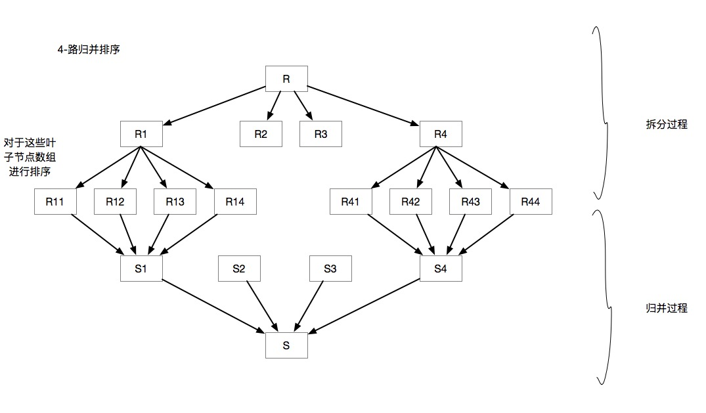
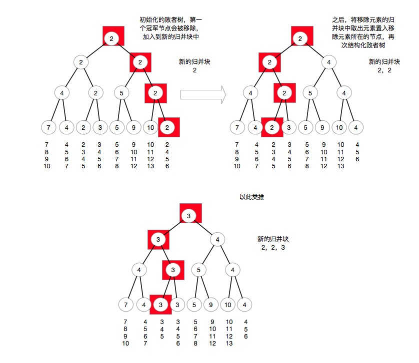

## 多路归并和败者树

### 多路归并排序

排序在是否使用外存这个方向上看，可以分为两种排序方法：外部排序和内部排序，在数据量比较小的时候，可以将全部的数据读入到内存中来进行排序，而在海量数据的情况下，这些数据不能够被完全读入到内存中，即使使用一些空间复杂度为O(1)的排序算法也是不可以的。虽然大部分的高效排序算法都是需要辅助空间的，比如快速排序需要平均`O(logn)`的调用栈。归并排序需要`O(n)`的辅助空间来进行归并。

由于数据不能够完整读入内存，很多排序算法都不能够正常使用，所以归并排序的外部方法提供了一种不需要将数据完全读入内存的排序思路。

比如，有一个含有20亿个数的文件，需要对这个文件中的数字进行排序，如果这些数字都是32位整型，那么每个数字需要的内存空间是32bit，也就是4个字节。也就是大概一共需要`20G * 4Bytes = 80G`的内存空间才能将这个文件完全读取出来。这是一个很庞大的内存量。

外部的k-路归并排序是将一个文件进行切分，将一个很大的文件切分成k个较小的文件，如果这k个较小的文件可以很好地读入内存，那么就完成了切分，否则进行递归，直到文件中的内容的大小到了一个合理的程度。

在切分完成之后，会得到很多小文件，将这些小文件读入到内存之中，然后使用各种内部排序方法对其进行排序，然后得到一些排序之后的小文件。之后对于这些小文件进行归并操作。由于在归并过程中生成的文件可能很大，所以也是不能够完全读取到内存中的。

这里读取每个小文件中的第一个元素，如果是升序排列的话，那么这个元素就是每个归并块的最小元素，进行比较，将最小的一个元素写入到一个新的归并块文件中，然后再从这个元素所在的归并块中取出第一个元素，依次类推，直到所有的归并块被读取完成，得到一个排序的归并块，这样递归上去，最终能够得到一个完整的排序后的文件。

这样可以计算一下时间复杂度，假设采用k-路归并，元素总数为n，总共需要归并的轮次为s，当归并块有m个的时候，需要的归并轮次也就是`s = log2km`，在每一层归并的时候，每个元素都要进行k-1次比较，和同属一个归并操作的另外k-1个元素都要进行比较来取得最小值。然后，每一层归并的时候，所有元素都要进行比较操作，也就是n-1次操作，这样可以得到总的时间复杂度为`log2k / log2m * (n - 1) * (k - 1)`。

对于这个复杂度进行向上取整：`log2km * n * k`，这样随着k的增长，时间复杂度也会增长，这样在优化的时候就导致了即使增大了k，那么时间复杂度也会有着一定的增长。所以就引出了败者树的思想。

### 败者树

为了减少在归并时候的比较操作的次数，这里引入一个数据结构叫做败者树来进行，败者树是一个具有k个叶子节点的完全二叉树，由于是完全二叉树，所以可用数组来对败者树来表示，败者树的的根节点叫做冠军节点，叶节点是备选节点，而剩余的所有中间节点是败者节点。

在归并开始的时候，从每个数组中提取一个第一个元素，也就是当前归并块中的最小的元素来构建败者树，将这些节点置于败者树的叶子节点上，然后对于败者树进行递归，在升序排列的情况下，同一个父节点的两个叶子节点进行比较，将较小的值推入父节点，然后递归进行，这样得到的冠军节点，也就是根节点的值就是这k个元素的最小值了。将这个最小的元素推入到新的归并块中，之后从这个元素的来源中再取出一个最新的值置入刚才冠军节点所空下来的位置上，对于这个分支进行败者树的修复操作，这样又可以得到一个冠军节点。

以此类推，当所有归并块中的元素都被读取完成之后，就可以得到一个新的排序归并块。这样，牺牲了`2k-1`个元素的内存空间数组（当然这个空间比较小），将每个元素的归并操作的比较次数从`k-1`缩减到了`log2k`。

这样可以计算时间复杂度为：`log2m / log2k * (n - 1) * log2k = (n - 1) * log2m`，这样就和归并路数无关了。