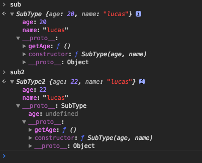

## JavaScript继承方式

### 继承

不同于一般的面向对象语言，JavaScript的继承主要是通过原型继承的方式来实现的。JavaScript所有的操作基本都是在对象上进行的，所以继承也是通过原型来实现的。由于在JavaScript中，函数是第一型对象，所以任何针对函数的继承操作也是基于原型链进行的，只是用函数来模拟构造方法，而不是实际意义上的类继承。

### 原型链继承

为了让子类继承父类的属性，首先定义一个构造函数，将父类的实例设置为该构造函数的原型，当对构造函数进行实例化的时候，该原型会自动附加到该实例上。

```javascript
function Parent(){
  this.name = 'mike';
}
function Child(){
  this.age = 12;
}
// 将Child构造函数的原型链接到Parent类的实例上面。
Child.prototype = new Parent();
var test = new Child();
```

在上面的代码中，原型链是这样的：`Child.prototype`-->`Parent.prototype`-->`Object.prototype`。随着一层一层的继承关系，原型链会越来越长。

为了让父类的构造函数能够正常使用，可以在子类中使用`Function.call`方法来调用父类的构造函数，就可以在构造子类的时候，调用父类的构造函数。

#### 组合继承

使用原型链继承，并且利用借调父类的构造函数这两个方法的组合，可以实现一种组合式继承，方法通过父类的原型传给子类，然后子类调用父类的构造函数来获得父类的一些属性，子类进行实例化就有了自己的变量和与其他子类共享的方法。

```javascript
function Parent(age){
  this.name = ['mike', 'jack', 'smith'];
  this.age = age;
}
Parent.prototype.run = function() {
  return this.name + ' are both' + this.age;
}
function Child(age){
  Parent.call(this, age);
}
Child.prototype = new Parent();
var test = new Child(20);
console.log(test.run())
```

组合继承其实和原型链继承的差别很少，使用了多一次的父类构造函数调用来获取父类的属性。

### 原型式继承

这种继承借助原型并且基于现有的对象来创建新的对象，并且不需要创建新的类，也就是直接构造出一个实例。

```javascript
function obj(o){
  function F(){};
  F.prototype = o;
  return new F();
}
var box = {
  name: 'trigkit4',
  arr: ['brother', 'sister', 'baba']
}
var b1 = obj(box);
// 通过对象原型直接构造一个新的实例，而不采用伪类的构造函数方法，在对象中临时创建一个构造函数。
```

#### 寄生式继承

这种继承方式是将原型和工厂模式结合起来，为每一种对象封装一个创建的过程函数。将构造好的对象实例返回回来。在封装函数内部对于新生成的对象进行增强，然后返回这个对象。

```javascript
function create(o){
  var f = obj(o);
  f.run = function(){
    return this.arr;
  }
  return f;
}
```

#### 组合式继承的问题

使用组合式继承的时候，父类实例的属性实际上是创建了两次的：

```javascript
function Parent(age) {
  this.age = age;
}
Parent.run = function() {}
function Child(age) {
  // 这是第二次调用父类构造函数，这一次会在子类的实例上添加实例属性，最终，这次添加的属性会屏蔽掉原型上的属性。
  Parent.call(this, age);
}
// 这是第一次调用父类的构造函数，这次调用会在子类的原型上面添加属性
Child.prototype = new Parent();
```

#### 寄生组合式继承

为了避免组合式继承的两次父类构造函数调用，并且将原型链保持稳定，使用寄生组合式继承。这个继承主要分为三个步骤：

1. 创建父类原型的一个副本。`var prototype = Object(superType.prototype)`
2. 然后为创建的副本的`contructor`属性进行修复。`prototype.constructor = subType`
3. 最后将新创建的原型对象赋值到子类的原型上。`subType.prototype = prototype`

这样只需要进行一次父类构造函数的调用了，因为原本修改子类原型的那次调用通过将父类原型上的方法进行复制取代了，这时候子类的实例上也不会有实例属性覆盖原型属性的情况出现。

```javascript
function inherit(superType, subType) {
  var prototype = Object(superType.prototype);
  prototype.constructor = subType;
  subType.prototype = prototype;
}
function Parent(age) {
  this.age = age;
}
Parent.prototype.run = function() {
  console.log(this.age);
}
function Child(age, name) {
  // 可以看到只调用了一次父类的构造函数
  Parent.call(this, age);
  this.name = name;
}
inherit(Parent, Child);
// 组合继承中使用的是 Child.prototype = new Parent() 来进行原型的复制操作
var child = new Child(20, 'lucas');
```



上面的`sub`对象是使用寄生组合式继承构建的，而`sub2`对象是使用组合式继承构建的。

可以看到对于寄生组合式继承实例的对象而言，其所有的实例属性都会直接绑定到实例上，并且原型上是干净的，只有从父类原型上获取的方法。

而组合式继承的对象，除了实例上的实例属性，父类属性还会被实例化到其原型上，而父类的方法则是在其原型对象的原型上，由于多了一层原型，所以在进行方法调用的时候，需要多进行一次原型链的查找，并且对象原型上面的属性是完全没有作用的，被屏蔽了的。

并且这两种继承方法对于`instanceof`运算符以及`isPrototypeOf`方法都是很友好的。

### new关键字的工作流程

通常我们都使用`new`关键字来实例化一个对象：

1. 首先这个关键字会先创建一个新的空对象。
2. 将这个空对象的原型指向构造函数的原型，由于构造函数的原型对象本身就有原型链，所以这样从新对象开始的一条原型链就形成了。
3. 然后以该新对象为上下文调用`new`修饰的构造函数，并且传递相应的参数进去。
4. 检查该构造函数是否有返回值，如果没有，那么就将这个新的对象返回回去。

这里面有一个要注意的地方，构造函数的原型链和其原型是没有关系的，构造函数的原型如果没有设置的话，那么会指向默认的`Function.prototype`。要记住，构造函数的原型并不会在其原型链上，只会在其实例化的原型链上。

### 对象委托

对象委托是一种不使用构造函数方法实现继承的方式，利用`Object.create`从父元素继承一系列的方法和属性，然后对于这个新的子元素，可以为其添加新的方法，这些新的方法可以调用从父元素复制过来的方法，这样做会导致子对象不能够对父对象的方法进行重载。

```Javascript
var Foo = {
  init: function (who) {
    this.me = who;
  },
  identify: function () {
    return "I am" + this.me;
  }
};
Bar = Object.create(Foo);
Bar.speak = function () {
  alert("Hello, " + this.identify() + ".");
};
var b1 = Object.create(Bar);
var b2 = Object.create(Bar);
b1.init("b1");
b2.init("b2");
```

当需要进行实例化的时候，就根据所谓的父对象复制一个新的子对象出来，然后通过调用自定义的初始化方法来进行组件的初始化。