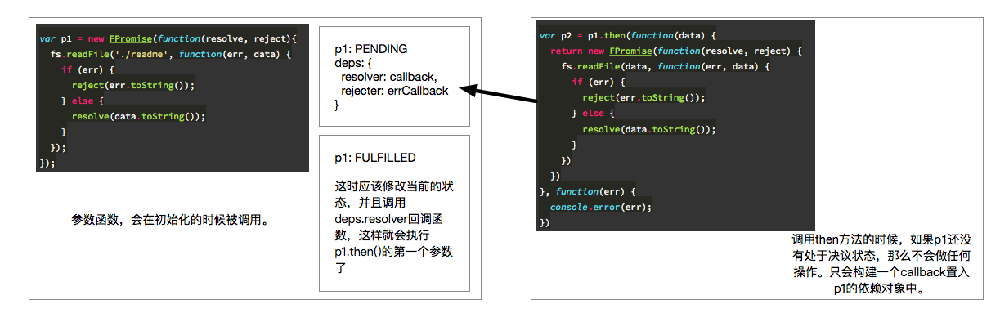

## 实现一个Promise-polyfill

### Promise

Promise是ES6标准提供的一个异步操作的很好的语法糖，对于原本的回调函数模式进行了封装，实现了对于异步操作的链式调用。并且配上generator以及async语法糖来使用更加方便。

虽然Promise当前在很多浏览器上都已经得到了支持，但是在看Promise的时候，发现对于Promise的很多地方仍然不是很了解。包括其内部的实现机制，写这个代码的目的也是在于对Promise的使用更加了如指掌。

`Promise`的具体使用方法可以看我的这一篇博客，这里就不对`Promise`对象本身的使用进行说明了，默认大家都已经掌握基本的`Promise`的使用方法了。如果不甚了解的话，请看[Promise、generator和async/await](https://github.com/LucaslEliane/lucas-blog/blob/master/JavaScript/asynchronous/asynchronous.md)。

### Promise对象的实现思路

#### 初始化

首先，对于ES6原生的`Promise`对象来说，在初始化的过程中，我们传递的是一个`function(resolve, reject){}`函数作为参数，而这个函数是用来进行异步操作的。

当写在这个参数函数中的异步操作成功之后，规范是将异步操作得到的结果进行处理之后，调用`resolve(data)`函数来对结果进行链式处理。

如果异步操作失败的话，那么自然就是将失败原因处理之后，调用`reject(err)`函数。

如下：

```javascript
var p = new Promise(function(resolve, reject) {
  fs.readFile('./readme', function(err, data) {
    if (err) {
      reject(err);
    } else {
      resolve(data);
    }
  });
});
```

也就是这个两个参数函数无论如何，都是会在异步操作完成之后调用的。

那针对这一点，可以先这样写`Promise`的构造函数(这是Promise-polyfill的大体框架和初始化函数)：

```Javascript
const promiseStatusSymbol = Symbol('PromiseStatus');
const promiseValueSymbol = Symbol('PromiseValue');
const STATUS = {
  PENDING: 'PENDING',
  FULFILLED: 'FULFILLED',
  REJECTED: 'REJECTED'
};
const transition = function(status) {
  var self = this;
  return function (value) {
    this[promiseStatusSymbol] = status;
    this[promiseValueSymbol] = value;
  }
}
const FPromise = function(resolver) {
  if (typeof resolver !== 'function') {
    throw new TypeError('parameter 1 must be a function');
  }
  this[promiseStatusSymbol] = STATUS.PENDING;
  this[promiseValueSymbol] = [];
  this.deps = {};
  resolver(
    // 这里返回两个函数，这两个函数也就是resolver和reject。
    // 这两个函数会分别对于当前Promise的状态和值进行修改
    transition.call(this, STATUS.FULFILLED),
    transition.call(this, STATUS.REJECTED)
  );
}
```

根据使用`Promise`的经验，其整个生命周期应该是具有状态的，当开始异步操作，但是还没有结果的时候，应该是挂起状态`PENDING`，然后是成功和失败的状态。

传入到构造函数中的函数需要在构造函数中被调用，来开始异步操作。然后通过我们传递进去的两个函数来分别修改成功和失败的状态以及值。

#### then方法

`then`方法应该是`Promise`进行链式调用的根本。

首先，`then`方法具有两个参数，分别是成功和失败的回调，

然后，其应该返回一个新的`Promise`对象来给链式的下一个节点进行调用，

最后，这里如果本身`Promise`对象的状态已经是`FULFILLED`或者`REJECTED`了，那么就可以直接调用回调函数了，否则需要等待异步操作的完成状态发生。

```javascript
FPromise.prototype.then = function(onFulfilled, onRejected) {
  const self = this;
  return FPromise(function(resolve, reject) {
    const callback = function() {
      // 注意这里，对于回调函数执行时候的返回值，也需要保存下来，
      // 因为链式调用的时候，这个参数应该传递给链式调用的下一个
      // resolve函数
      const resolveValue = onFulfilled(self[promiseValueSymbol]);
      resolve(resolveValue);
    }
    const errCallback = function() {
      const rejectValue = onRejected(self[promiseValueSymbol]);
      reject(rejectValue);
    }
    // 这里是对当前Promise状态的处理，如果上一个Promise在执行then方法之前就已经
    // 完成了，那么下一个Promise对应的回调应该直接执行
    if (self[promiseStatusSymbol] === STATUS.FULFILLED) {
      return callback();
    } else if (self[promiseStatusSymbol] === STATUS.REJECTED) {
      return errCallback();
    } else if (self[promiseStatusSymbol] === STATUS.PENDING) {
      self.deps.resolver = callback;
      self.deps.rejecter = errCallback;
    }
  })
}
```

但是如果当前的状态是`PENDING`呢，也就是之前`Promise`的异步操作还没有决议。这时候，成功和失败的函数调用应该保存到之前`Promise`的依赖当中。

当之前的`Promise`产生了一个决议，那么就可以调用`callback`和`errCallback`函数了。

这样说可能不是很清晰，下面的图可以看到`Promise`进行链式调用的方法。



上面的代码并不能够实现当p1决议了之后，可以调用p1.then生成的回调函数，所以这里要对之前的代码进行一些修改。

```Javascript
const transition = function(status) {
  return (value) => {
    this[promiseValueSymbol] = value;
    setStatus.call(this, status);
  }
}
/** 
  * 对于状态的改变进行控制，类似于存取器的效果。
  * 如果状态从 PENDING --> FULFILLED，则调用链式的下一个onFulfilled函数
  * 如果状态从 PENDING --> REJECTED， 则调用链式的下一个onRejected函数
  *
  * @returns void
  */
const setStatus = function(status) {
  this[promiseStatusSymbol] = status;
  if (status === STATUS.FULFILLED) {
    this.deps.resolver && this.deps.resolver();
  } else if (status === STATUS.REJECTED) {
    this.deps.rejecter && this.deps.rejecter();
  }
}
```

通过修改状态时候的一个存取器来拦截状态改变的操作，然后对于依赖的内容进行调用。

由于p2接收了p1返回的一个新的`Promise`对象，那么p2也可以进行类似p1的操作，可以调用p1的`then`方法来继续进行链式调用，比如我们定义了一个p3，接收p2链式调用的结果。

```Javascript
var p3 = p2.then(function(data) {
  console.log(data);
}, function(err) {
  console.error(err);
})
```

而这里p2的`then`方法中的两个回调函数又会被构造成`callback`和`errCallback`函数，添加到p2的deps依赖对象当中。

这里当然也是存在一点问题的，就比如上面p1的then方法返回了一个thenable对象，那么就需要对这个对象进行处理，将其进行执行。

那么如何执行呢，对于一个thenable对象来说，可以将其看成一个新的Promise，然后，这个Promise应该也是具有then方法的，直接调用其then方法其实就可以了，这里很难说清楚，代码中的注释有一定的解释。

```Javascript
const callback = function() {
  const resolveValue = onFulfilled(self[promiseValueSymbol]);
  // 这里是对于当返回值是一个thenable对象的时候，
  // 需要对其进行特殊处理，直接调用它的then方法来
  // 获取一个返回值
  if (resolveValue && typeof resolveValue.then === 'function') {
    // 这里调用了resolve之后，也就是将这个内嵌的Promise
    // 得到的值绑定到当前Promise的依赖中，其实和下面的
    // unthenable的情况是一致的
    resolveValue.then(function(data) {
      resolve(data);
    }, function(err) {
      reject(err);
    });
  } else {
    // 注意，这里是then方法进行链式调用的连接点
    // 当初始化状态或者上一次Promise的状态发生改变的时候
    // 这里会通过调用当前Promise成功的方法，来进行当前Promise的状态改变
    // 以及调用链式的下个Promise的回调
    resolve(resolveValue);
  }
}
```

这样就基本上实现了一个简单的Promise的功能，虽然代码很短，但是逻辑非常复杂，一不小心就会绕进去。

### 结论

具体的代码可以参见我的github中的[fake-promise](https://github.com/LucaslEliane/lucas-blog/blob/master/JavaScript/asynchronous/async/fake-promise.js)。

这个依赖收集的方法在很多项目的源代码中都有使用过，比如Vue、RequireJS等，[RequireJS的实现也可以看这里](https://github.com/LucaslEliane/simple-require)

这里有几个重点，其实在调用then方法的时候，只是依赖添加的过程，并不是执行两个回调函数。

并且在初始化的时候，传入的函数参数会立即调用，而`resolve`和`reject`两个参数是用来对于状态进行修改的。

Promise的链式调用的过程主要是一个对于依赖进行依次收集的过程，这个过程将每个Promise耦合在了一起。